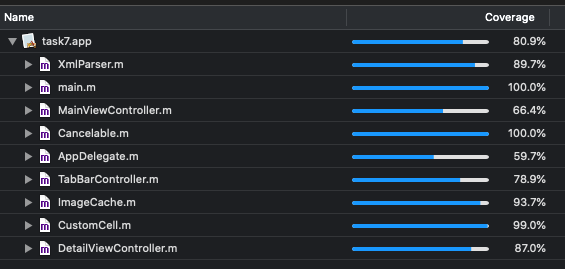

# Project Name: rs.ios-stage2-task7

## Description:

Разработка адаптивного приложения галереи под iPhone/iPad.  
Научиться работать с разными UI элементами и системными библиотеками.  
Получать данные из интернета и обрабатывать их.

## Project requirements

● поддерживать iOS версии от 11.0 и выше  
● использовать ARC  
● использовать xib и autolayout. Storyboard использовать нельзя  
● поддерживать все размеры устройств, а также все возможные ориентации  
● для iPad отображение должно быть таким же, как для iPhone. Не нужно использовать SplitView  
● Сохранять любимые видео в закладки при помощи Core Data  

### Installation:

1. Скачать Git-репозиторий  
2. Установить на устройство под управление iOS 11.0+ с помощью xCode

## Work example:

  

## Additional information

Technical Task - https://docs.google.com/document/d/1ndEb5of7J-q3XeVtAO3TLwbJjM4MdBY8n9IPcArNCWY/edit  
